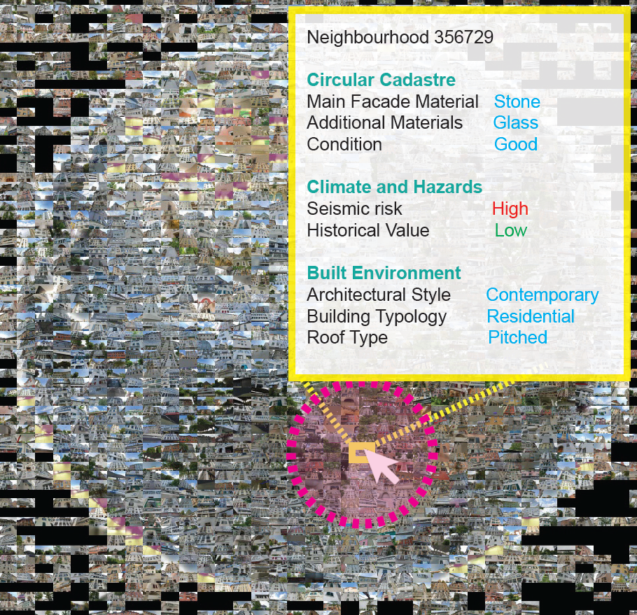

# URBAN-AI

**Urban-scale facade material mapping from street view images using vision–language models for circular construction planning**



URBAN-AI is a workflow that uses multimodal AI to infer building material and facade characteristics from street-level imagery, applied across six cities spanning high- to low-income contexts: **Zurich, San Francisco, Melbourne, Mumbai, Cape Town, and Rio de Janeiro**. This repository contains the companion website and the per-city facade-mapping result datasets.

🌐 **Live site:** https://raghudeepika.github.io/URBAN-AI/
📄 **Paper (open access, *Scientific Reports*):** https://www.nature.com/articles/s41598-026-51028-6

---

## About the project

The lack of reliable building-level data is a long-standing obstacle for urban sustainability and circular-economy practices. URBAN-AI addresses this by combining street-view imagery, **Grounded-SAM** for facade detection, and **GPT-4V** for attribute inference to produce building-level information — typology, material type, condition, and architectural style — together with image-based screening indicators for downstream applications (historical facade, seismic retrofit, energy retrofit, urban morphology, facade greening suitability, and flood exposure proxies).

The study contributes two open resources: the **Global Building Facade Dataset** and the **URBAN-AI workflow**.

### Headline numbers

| Metric | Value |
| --- | --- |
| Cities | 6 |
| Candidate street-view images | 57,918 |
| High-confidence facade images | 9,254 |
| Human-validated outputs | 9,056 |
| Mean composite module accuracy | 87.7% |

### Cities and focus indicators

| City | City-specific indicator |
| --- | --- |
| Zurich | Historical facade proxy |
| San Francisco | Seismic retrofit proxy |
| Melbourne | Energy retrofit proxy |
| Mumbai | Urban morphology indicators |
| Cape Town | Facade greening suitability |
| Rio de Janeiro | Flood exposure proxy |

---

## The website

The site is a static front end — no build step and no framework. It renders the paper summary, an interactive [Leaflet](https://leafletjs.com/) map explorer for browsing and comparing per-city results, and download links for each city's result dataset. All page content is driven by a single data file (`data/site-data.json`), and each city's geometry is loaded on demand from its GeoJSON file.

### Run it locally

Because the page fetches JSON and GeoJSON at runtime, opening `index.html` directly from the file system will not work (browsers block `fetch` over the `file://` protocol). Serve the folder over HTTP instead:

```bash
# from the repository root
python3 -m http.server 8000
```

Then open <http://localhost:8000> in your browser.

Any equivalent static server works just as well, for example:

```bash
npx serve .
```

### Deployment

The live version is hosted with **GitHub Pages** from the `main` branch. Pushing changes to `main` redeploys automatically within a minute or two. After a deploy, a hard refresh (`Ctrl/Cmd + Shift + R`) may be needed to clear cached copies of `data/site-data.json`.

---

## Repository structure

```
URBAN-AI/
├── index.html              # Page markup and layout
├── app.js                  # Loads data, renders content, drives the Leaflet map
├── styles.css              # Site styling
├── main-image.png          # Hero image
├── *.png                   # City previews, workflow images, partner/funder logos
├── data/
│   ├── site-data.json      # Single source of truth: paper info, metrics, per-city config
│   └── <city>-materials.geojson   # Facade-level results geometry, one per city
└── downloads/
    └── <city>_materials.zip       # Per-city result shapefiles (zipped)
```

### `data/`

`site-data.json` holds the paper metadata, headline metrics, and per-city configuration (map center, bounds, mappable attribute fields, and pre-computed category counts).

The `*-materials.geojson` files contain the mapped facade results for each city. Attributes vary by city but generally include main facade material, building condition, architectural style, building type, roof type, and the relevant city-specific screening indicator.

### `downloads/`

Each `<city>_materials.zip` is a zipped shapefile of that city's results, linked from the site for download. Available for all six cities.

---

## Citation

If you use this work, please cite:

> Raghu, D., Armeni, I. & De Wolf, C. Urban-scale facade material mapping from street view images using vision–language models for circular construction planning. *Sci Rep* (2026). https://doi.org/10.1038/s41598-026-51028-6

---

## Authors

- **Deepika Raghu** — ETH Zurich (D-BAUG)
- **Iro Armeni** — Stanford University (CEE)
- **Catherine De Wolf** — ETH Zurich (D-BAUG)

Developed in collaboration with the **Future Cities Lab Global** at ETH Zurich.

## Funding

Funded by the **Swiss National Science Foundation (SNSF)** [Grant No. 215311] for the project *"Re-engineering informal construction through circular practices and models."*

## License

The code in this repository is released under the [MIT License](./LICENSE).

The paper is published open access under a [Creative Commons Attribution 4.0 International (CC BY 4.0)](http://creativecommons.org/licenses/by/4.0/) license. Result datasets in `data/` and `downloads/` are provided for research use; please cite the paper above when using them.
